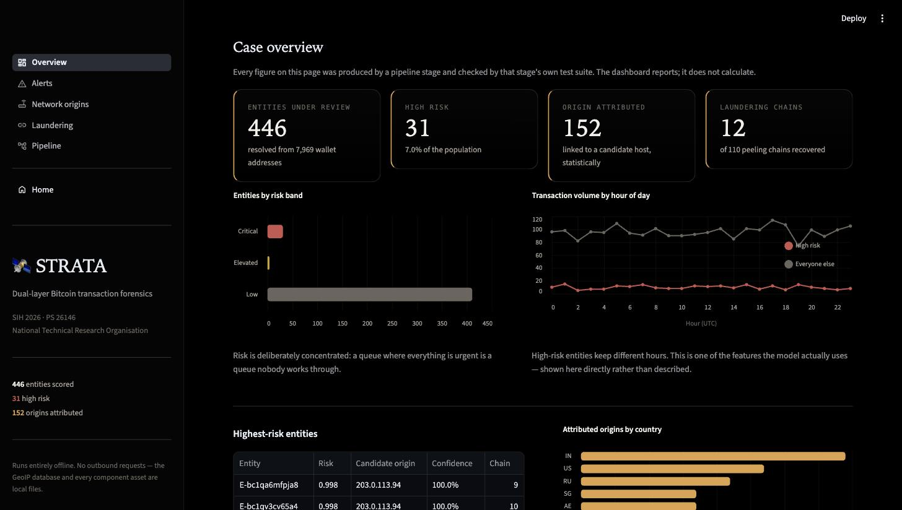
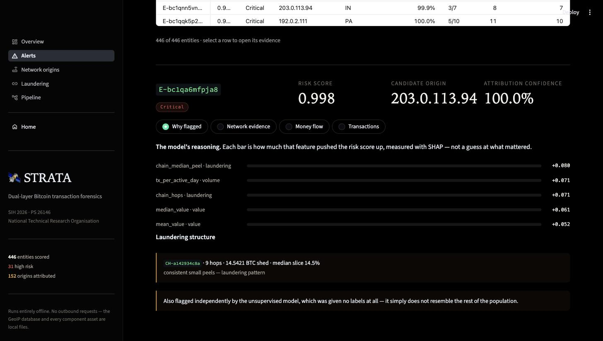
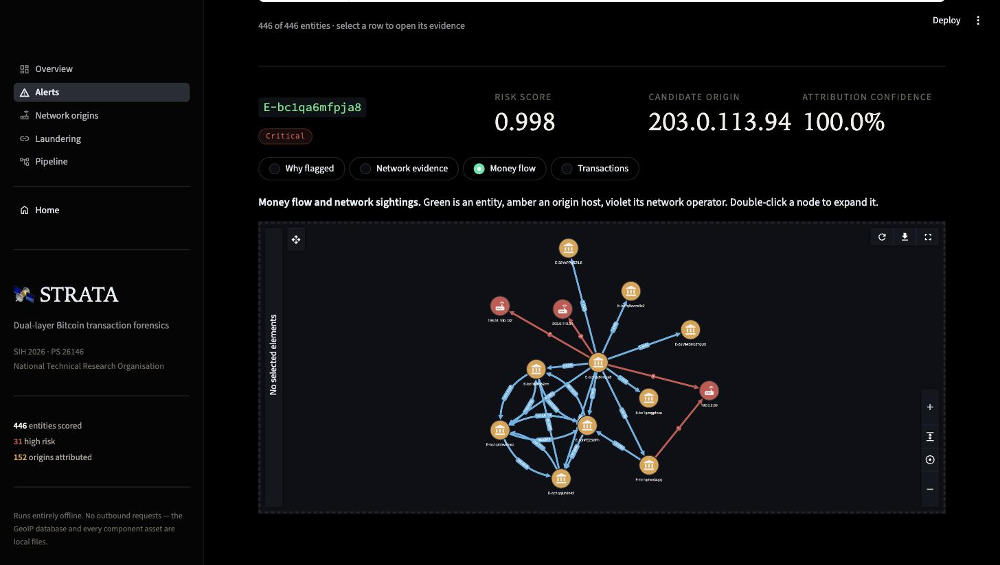
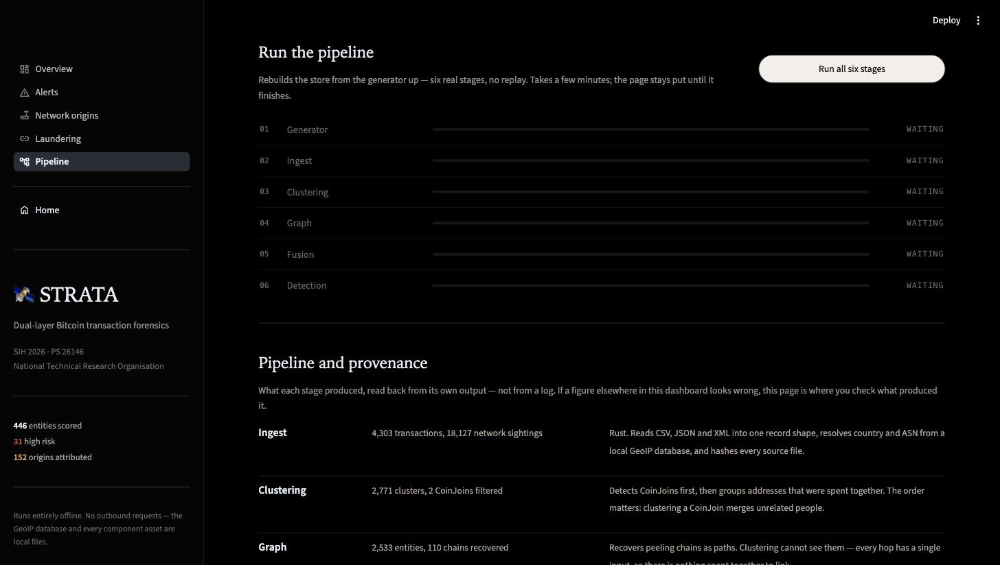

# STRATA

**Dual-layer Bitcoin transaction forensics.** Correlates peer-to-peer network telemetry with blockchain ledger data to produce ranked, explainable investigative leads — entirely offline.

> Smart India Hackathon 2026 · Problem Statement **26146** · National Technical Research Organisation (NTRO)
> Theme: Blockchain & Cybersecurity

---

## Project information

| | |
|---|---|
| **Project title** | STRATA — AI-Powered Monitoring and Analysis of Bitcoin Transaction Traffic |
| **PS ID** | 26146 |
| **PS title** | AI-Powered Monitoring & Analysis of Bitcoin Transaction Traffic |
| **Organisation** | National Technical Research Organisation (NTRO) |
| **Category** | Software |
| **Theme** | Blockchain & Cybersecurity |

**Live:** [landing page](https://strata-alpha-two.vercel.app/) · [forensic explorer](https://strata-forensics.streamlit.app/)
Both are public and need no login. Reviewer walkthrough: [`submission/DEMO.md`](submission/DEMO.md).

---

## Key features

- **Dual-layer correlation.** Joins blockchain records with peer-to-peer network
  telemetry on approximate time — the join no ledger-only tool can make, and
  what turns a wallet address into a candidate host.
- **Statistical attribution, not assertion.** Every lead carries the sighting
  count it rests on and the probability of seeing that count by accident,
  corrected for the number of host-and-entity pairs tested.
- **Entity resolution that refuses to guess.** CoinJoins are detected and
  excluded before clustering, because clustering one merges unrelated people
  and nothing errors.
- **Peeling-chain recovery.** Laundering chains reconstructed as graph paths,
  which clustering structurally cannot see.
- **Explainable scoring.** A supervised model for known patterns and an
  unsupervised one for anything new, with every score decomposed by SHAP into
  named factors. Never a bare number.
- **Bulk multi-format ingest.** CSV, JSON and XML into one shape at ~40,000
  records/sec, with a SHA-256 chain-of-custody manifest and GeoIP enrichment.
- **Runs with the network switched off.** No outbound request at any stage.
- **Measured, not claimed.** Every stage ships a test suite scored against the
  generator's ground truth, including negative controls.

---

## Screenshots

| | |
|---|---|
|  |  |
| *Landing page* | *Case overview* |
|  |  |
| *Why an entity was flagged — SHAP factors* | *Money flow and first-relay sightings* |


*The pipeline, runnable live from the dashboard*

More in [`assets/screenshots/`](assets/screenshots/).

---

## Team

**Team LATENT** · Netaji Subhas University of Technology

**Team Leader:** Raj Aryan — [@aryanraj45](https://github.com/aryanraj45)Ingest and tooling 

| Name | Roll Number | GitHub | Role |
|---|---|---|---|
| Raj Aryan | 2024UIC4038 | [@aryanraj45](https://github.com/aryanraj45) | Team Leader · pipeline architecture |
| Devansh Vashisht| 2024UIC3507 |[@devvaansh](https://github.com/devvaansh)| Ingest and tooling |
| Mansi Singh | 2024UIC3589 | [@MansiS7](https://github.com/MansiS7)| Dashboard & presentation  |
| Priyanshu Mahalan | 2024UIC3506 | [@Priyanshu-rgbb](https://github.com/Priyanshu-rgbb) | Research |
| Srushti Chaudhari | 2026UCA1845 | [@srushtichaudhariug26](https://github.com/srushtichaudhariug26) | Research |
| Vagisha Mandal | 2026UCA1860 | [@vagisha26](https://github.com/vagisha26) | Research & documentation |

---

## Submission

- Presentation: [`https://drive.google.com/drive/folders/1gTYdoBcpPKOEs9QfW0U6DAmdZ5HY2TNg?usp=sharing`](submission/PRESENTATION.md)
- Demo and reviewer walkthrough: [`submission/DEMO.md`](submission/DEMO.md)
- Architecture: [`docs/architecture.md`](docs/architecture.md)

---

## The idea

The Bitcoin ledger tells you **what** moved. It never tells you **who**.

But before a transaction reaches the ledger, it travels the peer-to-peer network — and in that moment it carries an IP address. That information survives for a few hundred milliseconds and is then discarded forever.

STRATA captures both layers and joins them on time:

| Layer | Contains | Missing |
|---|---|---|
| **L1 — Ledger** | TXID, wallets, amounts, fee, script type | any identity |
| **L2 — Network** | src/dst IP, port, sub-millisecond timestamp, geo/ASN | any money context |
| **Fusion** | → wallet cluster ↔ candidate origin IP, with confidence | — |

One observation proves nothing. But when a wallet cluster's transactions are first-relayed from the same source in 96 of 140 cases, against a baseline under 1%, chance stops being a plausible explanation.

**Every output is a lead, never a proof.** Confidence is reported, and every score is decomposed into the factors that produced it.

---

## Constraints

Set by the problem statement, not by preference:

- **Fully offline.** No external APIs, no cloud services, no outbound connections at runtime.
- **Linux deployment target.**
- **Bulk metadata input** in CSV / JSON / XML.
- **Synthetic dataset** — no real seized or intercepted data. We generate it, which means we have ground truth.
- **Explainable output** — a ranked alert list stating why each entity was flagged, with a confidence score.

---

## Architecture

```
 synthetic data ──┐
 GeoIP .mmdb ─────┼──▶ Rust ingest ──┬──▶ ClickHouse (bulk)
 (LN gossip) ─────┘   csv/simd-json  │      tx_l1 · net_l2
                      quick-xml      └──▶ Neo4j (entity graph)
                      rayon                Wallet · Cluster · IP · ASN
                            │
                            ▼
                    Fusion + Intelligence
                    ① ±500ms window on TXID
                    ② rank relays by arrival
                    ③ weight w = 1/rank
                    ④ Σw per (cluster, IP)
                    ⑤ z-test vs baseline
                    ⑥ geo/ASN concentration
                            │
                    CIOH clustering · RF · IsolationForest
                    GraphSAGE · SHAP attribution
                            │
                            ▼
                  Streamlit forensic dashboard
                  ranked alerts · flow graph · evidence · map
```

### Stack

| Layer | Choice |
|---|---|
| Ingest | Rust — `csv`, `simd-json`, `quick-xml`, `rayon`, `maxminddb` |
| Python bridge | PyO3 + maturin |
| Hardening | `cargo-fuzz` on all three parser entry points |
| Bulk store | ClickHouse (MergeTree) |
| Entity graph | Neo4j Community |
| ML | scikit-learn → PyTorch Geometric (GraphSAGE) |
| Explainability | SHAP + GNNExplainer |
| Dashboard | Streamlit + `streamlit-aggrid` + `st-link-analysis` |

---

## Detection use cases

| ID | Detects |
|---|---|
| UC-1 | Entity clustering — many addresses, one actor (CIOH) |
| UC-2 | Layering / peeling chains |
| UC-3 | Mixer / CoinJoin participation |
| UC-4 | Illicit typology classification |
| **UC-5** | **Network-origin attribution — the core contribution** |
| UC-6 | Behavioural anomaly (unsupervised) |
| UC-7 | Geo / ASN anomaly — VPN rotation, impossible travel |
| UC-8 | Structuring / threshold evasion |
| UC-9 | Wallet-software fingerprinting |
| UC-10 | Cash-out point detection |

The problem statement references a table of AI/ML focus areas that was never attached (the placeholder text remains live on the portal). These use cases are derived strictly from the crime types and data fields the statement itself names.

---

## Running it after a clone

The dataset, the store and the Rust binary are all build outputs and none of
them are committed, so a fresh clone has the code but nothing to look at yet.
Four steps, from nothing to a running dashboard:

```bash
python3 -m venv .venv && .venv/bin/pip install -r requirements.txt
cargo build --release --manifest-path ingest/Cargo.toml   # the ingest binary
.venv/bin/streamlit run dashboard/app.py                  # opens on :8502
```

The dashboard opens on its "run the pipeline first" screen. Go to **Pipeline →
Run all six stages** and press it: that builds the dataset and the store in
front of you, in about fifteen seconds, and every figure in the app comes from
what it produced.

To build the store from a terminal instead:

```bash
.venv/bin/python generator/generate.py --out data --volume 5950 --days 14 --seed 42
./ingest/target/release/strata-ingest data/strata.* --geoip data/geoip --out store
for stage in cluster graph fusion; do .venv/bin/python $stage/run.py --store store; done
.venv/bin/python models/run.py --store store --data data
```

Pass the same `--seed` to get the same dataset. Each stage has a `verify.py`
beside it that scores its output against the generator's ground truth; run
those rather than trusting the numbers on screen.

The landing page is static and needs no build:

```bash
python3 -m http.server 8899 --directory site      # opens on :8899
```

---

## Repository layout

```
generator/     synthetic dataset generator + ground truth      [phase 0]
ingest/        Rust parser, GeoIP enrichment, fuzz targets     [phase 1]
cluster/       CoinJoin filter, CIOH, change heuristics        [phase 2]
fusion/        the dual-layer correlation engine               [phase 3]
graph/         Neo4j loaders and Cypher queries                [phase 4]
models/        RF, IsolationForest, GraphSAGE, SHAP            [phase 5]
dashboard/     Streamlit app                                   [phase 6]
docs/          technical write-up                              [phase 7]
data/          GeoIP .mmdb, datasets (gitignored where large)
```

---

## Build order

Phase 0 first — nothing else can be measured without it.

1. **Synthetic data generator** — PS field list, planted peeling chains and CoinJoins, realistic propagation jitter, decoys, ground-truth file
2. **Rust ingest** + GeoIP enrichment → ClickHouse
3. **CoinJoin filter → CIOH clustering** (order matters; filtering second corrupts every result)
4. **Fusion engine** — the project
5. **Neo4j graph** + peeling-chain traversal
6. **RF + IsolationForest + SHAP**
7. **Streamlit dashboard**
8. **Technical write-up**

Then, if time allows: `cargo-fuzz` hardening, GraphSAGE comparison, Lightning funding detector.

---

## Offline deployment

Everything is vendored before it is needed. `cargo build`, `pip install` and `docker pull` all fail on an air-gapped machine.

```bash
cargo vendor > .cargo/config.toml
pip download -r requirements.txt -d ./wheelhouse
docker save clickhouse/clickhouse-server neo4j:community -o images.tar
```

Full dry run with the network adapter disabled, on the actual demo machine, at least a day early.

---

## Notes

- `streamlit-aggrid` must be `>= 1.2.0` — earlier releases enabled AG Grid **Enterprise** modules by default, which require a paid licence. Community features only.
- `st-link-analysis` node icons: use the **name** form, never the URL form. A URL is an outbound call.
- Split Elliptic++ by **time**, never randomly — a random split leaks the future into training.

---

## Status

Pre-alpha. Nothing built yet.
